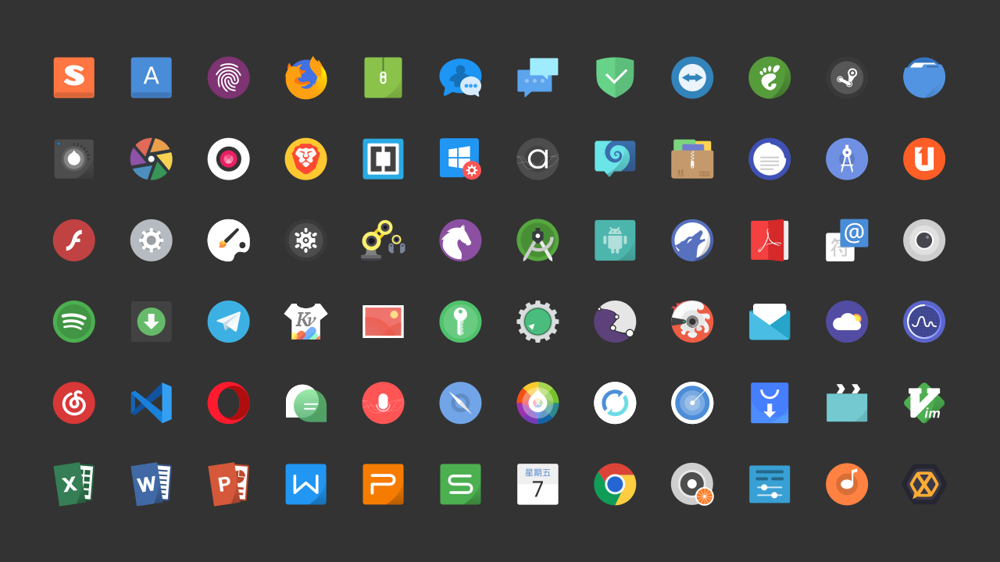
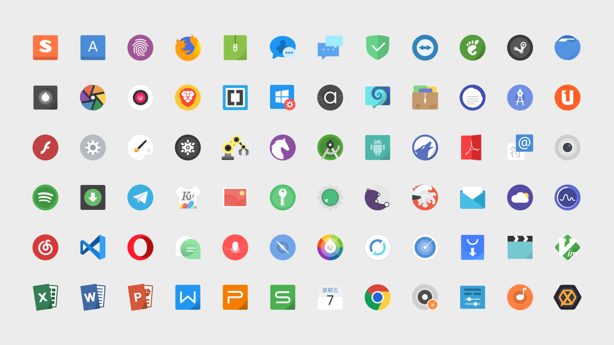

## Tela Icon Theme
<span class="paypal"><a href="https://twitter.com/intent/follow?screen_name=vinceliuice" title="Twitter Follow"></a></span>

A flat, colorful icon theme




## Donate

If you like my project, you can buy me a coffee:

<span class="paypal"><a href="https://www.paypal.me/vinceliuice" title="Donate to this project using Paypal"></a></span>

## Installation

Usage:  `./install.sh`  **[OPTIONS...]** **[COLOR VARIANTS...]**

|  OPTIONS: |                                                                               |
|:----------|:------------------------------------------------------------------------------|
| -a        | Install all color versions                                                    |
| -c        | Install colorscheme version for KDE plasma(folder color follow colorscheme)   |
| -d        | Specify theme destination directory (**Default:** _$HOME/.local/share/icons_) |
| -n        | Specify theme name (**Default:** _Tela_)                                      |
| -h        | Show this help                                                                |

|  COLOR VARIANTS |                                       |
|:----------------|:--------------------------------------|
| standard        | Standard color folder version         |
| black           | Black color folder version            |
| blue            | Blue color folder version             |
| brown           | Brown color folder version            |
| green           | Green color folder version            |
| grey            | Grey color folder version             |
| orange          | Orange color folder version           |
| pink            | Pink color folder version             |
| purple          | Purple color folder version           |
| red             | Red color folder version              |
| yellow          | yellow color folder version           |
| manjaro         | Manjaro default color folder version  |
| ubuntu          | Ubuntu default color folder version   |
| nord            | Nord color folder version             |

By default, only **the standard one** is selected.

### On Snapcraft

<a href="https://snapcraft.io/tela-icons">

</a>

You can install the theme from the Snap Store оr by running:

```
sudo snap install tela-icons
```
To connect the theme to an app run:
```
sudo snap connect [other snap]:icon-themes tela-icons:icon-themes
```

### On Gentoo Linux

First, you can add [Beatussum's overlay](https://github.com/beatussum/beatussum-overlay) by using [Layman](https://wiki.gentoo.org/wiki/Layman):

```bash
layman --list
layman --add  beatussum-overlay
layman --sync beatussum-overlay
```

And install the _x11-themes/tela-icon-theme_ package.
